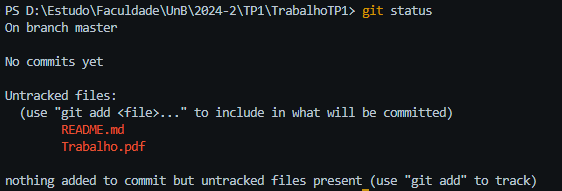
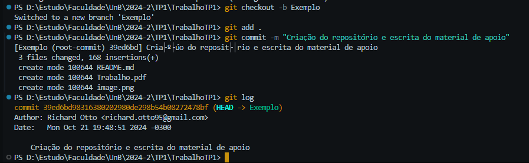
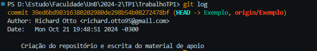

# Trabalho TP1

## Parte 1

### Domínios

Para cada domínio deve ser codificada uma classe e para cada uma dessas classes deve haver uma outra classe de teste.

- <input type="checkbox"> Avaliação  
    -   <details>
        <summary> Formato Válido </summary>
            Dígito de 1 a 5.
        </details>

- <input type="checkbox"> Código 
    -   <details>
        <summary> Formato Válido </summary>
            Seis caracteres <br>
            Cada caracter pode ser letra  (A - Z ou a - z) <br>
            Cada caracter pode ser dígito (0 - 9)
        </details>

- <input type="checkbox"> Data 
    -   <details>
        <summary> Formato Válido </summary>
            Formato DD-MM-AA <br>
            DD - 00 a 31 <br>
            MM - 01 a 12 <br>
            AA - 00 a 99 <br>
            Levar em consideração anos bissextos
        </details>

- <input type="checkbox"> Dinheiro 
    -   <details>
        <summary> Formato Válido </summary>
            Valor de 0,00 a 200.000,00
        </details>

- <input type="checkbox"> Duração 
    -   <details>
        <summary> Formato Válido </summary>
            Valor de 0 a 360
        </details>

- <input type="checkbox"> Horário 
    -   <details>
        <summary> Formato Válido </summary>
            Formato HH:MM <br>
            HH pode ser 00 a 23 <br>
            MM pode ser 00 a 59
        </details>

- <input type="checkbox"> Nome 
    -   <details>
        <summary> Formato Válido </summary>
            Texto com até 30 caracteres
        </details>

- <input type="checkbox"> Senha 
    -   <details>
        <summary> Formato Válido </summary>
            Cinco dígitos (0 - 9) <br>
            Não há dígito duplicado <br>
            Os seis dígitos não podem estar em ordem crescente (01234, 12345, 23456 etc.) <br>
            Os seis dígitos não podem estar em ordem descrescente (43210, 54321, 65432 etc.)
        </details>

### Entidades

- <input type="checkbox"> Conta 
    - Código
    - Senha

- <input type="checkbox"> Viagem
    - Código
    - Nome
    - Avaliação

- <input type="checkbox"> Destino
    - Código
    - Nome
    - Data de início
    - Data de término
    - Avaliação

- <input type="checkbox"> Atividade
    - Código
    - Nome 
    - Data
    - Horário
    - Duração
    - Preço
    - Avaliação

- <input type="checkbox"> Hospedagem
    - Código
    - Nome
    - Diária
    - Avaliação

## Protocolo GIT

### Baixando e Instalando

O `GIT` é um protocolo utilizado para versionamento de código e estaremos utilizando a plataforma `GitHub` para fazer todo o gerenciamento do trabalho.

Antes de tudo, o `GIT` deve ser baixado [neste link](https://git-scm.com/downloads) e instalado em sua máquina rodando o executável.

### Clonando Repositório

Após isso, abra a sua `CLI` preferida e navegue até o diretório de sua preferencia para `Clonar` o seu projeto.

```
cd C:UnB/TP1/
```

Dentro do diretório digite `git init` e em seguida `git clone <CaminhoDoRepositório>`.

```
git init
git clone https://github.com/RichardOtto95/TrabalhoTP1.git
```

Pronto, o repositório estará clonado no local de destino. Agora basta navegar para dentro dele para podermos prosseguir.

```
cd TrabalhoTP1
```

### Preparando e enviando alterações

Ao criar, editar ou excluir arquivos neste diretório, eles poderão ser consultados ao digitar `git status`.



Na imagem acima também podemos ver em qual `branch` está. 

Para criar uma nova branch usamos `git checkout -b`.

```
git checkout -b Exemplo
```

Agora precisamos preparar as alterações para serem enviadas para o repositório remoto.

Utilize `git add` para preparar as alterações.

> **Obs:** Ao utilizar o `git add`, voce deve fornecer um parametro na frente especificando os arquivos que voce vai preparar.

Exemplos:

```
git add .           // Prepara todos os arquivos 
git add README.md   // Prepara o arquivo de nome especificado
git add -p          // Permite escolher entre alterações especificas
```

Quando terminar de preparar suas alterações, iremos criar uma espécie de "pacote" para enviar essas alterações. 

Esse "pacote" se chama `Commit` e utilizamos `git commit -m ""` para criar um commit com as alterações que estão preparadas e apelidando-o com uma breve descrição.

```
git commit -m "Criação do repositório e escrita do material de apoio"
```

Agora um commit foi criado com as alterações que voce preparou e esse commit pode ser consultado utilizando `git log`.



Note que na imagem de exemplo acima, o último e único commit tem escrito `(HEAD -> Exemplo)` e esses dados representam, respectivamente, que este commit é a "Cabeça" da branch especificada logo após a seta, que no nosso caso é a "Exemplo".

Ainda não terminou, pois nem a branch, nem o commit e muito menos nossas alterações foram registradas no nosso repositório remoto, mas para isso é bem simples, basta utilizar `git push -u origin <NomeDaBranch>`.

```
git push -u origin Exemplo
```



Agora sim! Todos os nossos dados estão registrados no repositório remoto, podendo ser visto por todos os outros colaboradores. Note também que agora temos uma descricão `origin/Exemplo` no commit, o que nos indica que este commit também é a "Cabeça" da nossa `branch` remote. Para concluir esse processo, basta criar um `pull request` na plataforma GIT, para o supervisor verificar o código e permitir que ele se junte ao restante do código na branch `main`.

Conforme os `pull-request` forem aceitos, a sua branch `main` local ficará desatualizada e para resolver isso basta alternar para a branch main e utilizar o `git pull` para receber os `commits` mais recentes.

```
git checkout main
git pull origin main
```

Ou, alternativamente para casos mais avançados, utilize `git fetch origin main:main` para atualizar sua `main` sem sair da sua `branch` atual e `git rebase main` para trazer os commits da `main`. Lembrando que se voce procurar realizar esse procedimento sem uma boa noção de `GIT`, pode ocorrer de voce perder todas as alterações realizadas em commits da branch atual. Frizo isso pois após atualizar a branch, vc precisa fazer um `git push -f` para sobrepor o histórico de commit de sua branch remota.

```
git fetch origin main:main
git rebase main
git push -f
```